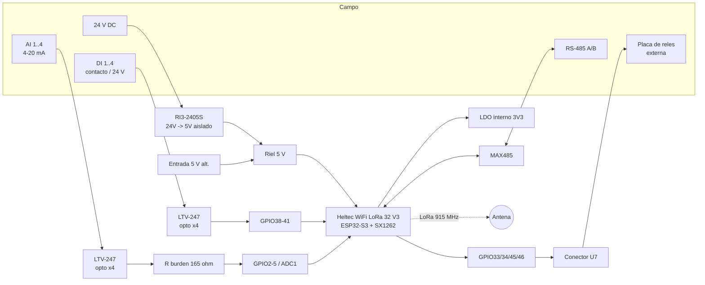

# Manual electrónico — Nodo IO LoRa (Aysafi)

**Producto:** `Remote_nodeIO_Hardware` — placa portadora (*carrier*) para módulo **Heltec WiFi LoRa 32 V3**
**Referencia de placa (serigrafía):** `NODE-IO-2405 · 4DI · 4AI · 4RO`
**Versión de hardware:** V1.0 (esquema `Schematic1`, 2026‑09‑08 · Gerbers PCB1, 2026‑08‑30)
**Repositorio:** <https://github.com/asdrubalfuentes/nodeIO_Hardware>
**Firmware asociado:** `nodeIO` (nodo/responder) y `nodeIO_master` (pasarela LoRa↔Modbus)
**Autor:** Ing. Asdrúbal Fuentes — Aysafi · **Fecha:** 2026‑09‑09

> Documento de ingeniería electrónica: descripción funcional bloque por bloque, mapa
> de pines, valores de cálculo, puntos de prueba y **propuestas de mejora de hardware**
> (sección 9). Complementa a `nodeIO/user manual.md` (uso) y `nodeIO/PROTOCOL.md` (enlace LoRa).

---

## 1. Descripción general

El Nodo IO es un módulo de **E/S remota industrial** gobernado por radio LoRa. Sobre una
placa portadora propia se monta un **Heltec WiFi LoRa 32 V3** (SoC **ESP32‑S3FN8** +
transceptor **Semtech SX1262**, OLED 128×64 integrada). La portadora añade:

| Bloque | Cantidad | Función |
|---|---|---|
| Entradas digitales aisladas (DI) | 4 | Contacto seco / 24 V de campo → optoacoplador → GPIO |
| Entradas analógicas de lazo (AI) | 4 | 4–20 mA → optoacoplador → resistencia de carga → ADC |
| Salidas de relé (RO) | 4 | Nivel lógico 3,3 V a conector (driver de relé **externo**) |
| Puerto RS‑485 | 1 | Semidúplex, MAX485, terminación 120 Ω |
| Fuente aislada | 1 | DC‑DC 24 V → 5 V (RECOM RI3‑2405S) + entrada alternativa de 5 V |
| HMI local | — | OLED del módulo, 2 pulsadores de usuario, pulsador PRG, LED |

**Datos físicos** (`Info_PCB_PCB1_2026-08-30.txt`): 89,845 × 55,795 mm · 2 capas de cobre ·
38 componentes · 30 vías pasantes · 1 458 mm de pista · 4 taladros de montaje.

### 1.1 Diagrama de bloques



---

## 2. Alimentación

### 2.1 Topología

Dos vías de entrada **excluyentes**, ambas confluyen en el riel de **5 V** que alimenta el
pin `5V` del módulo Heltec (de ahí su LDO interno **ME6211** genera los **3,3 V**):

| Ref. | Conector | Entrada | Notas |
|---|---|---|---|
| **U5** | `DB125‑2.54‑2P` | **12–32 V DC (serigrafía)** | Va al DC‑DC U31. *Ver aviso 9.1.* |
| **U35** | `DB125‑2.54‑2P` | **5 V DC** | Inyección directa al riel de 5 V, sin conversión. |
| **U31** | `RI3‑2405S` (RECOM) | 24 V → 5 V | DC‑DC **aislado ~3 kVDC**, **no regulado**, 5 V / **600 mA** / 3 W. |
| **C1** | 220 µF | Reservorio en 5 V | SMD alu. |
| **C2** | 220 µF | Reservorio en 3,3 V | SMD alu. |

Aislamiento galvánico entre el 0 V de campo (`GND` de U5) y el 0 V de electrónica lo aporta
**únicamente U31**. La entrada de 5 V (U35) **no está aislada**.

### 2.2 Presupuesto de consumo del riel de 5 V (estimado)

| Carga | Típico | Pico |
|---|---:|---:|
| Heltec V3 (ESP32‑S3 + LDO + SX1262 RX) | 90 mA | — |
| Heltec V3 con WiFi asociado + SX1262 en TX 14–22 dBm | — | 350–450 mA |
| OLED 128×64 | 10–15 mA | 20 mA |
| MAX485 transmitiendo sobre 60 Ω (2×120 Ω) | 5 mA | 55–60 mA |
| Fototransistores AI (lado 3,3 V) | ≤ 20 mA | — |
| **Total** | ~130 mA | **~500 mA** |

Margen frente a los 600 mA del RI3‑2405S **escaso**; la salida además **no es regulada**
(cae con la carga y sube en vacío). Ver mejoras 9.1 y 9.17.

### 2.3 Referencias de masa

El esquema separa **`AGND`** (retorno analógico del bloque AI / U32) de **`GND`** digital,
unidos en un punto. Buen criterio; reforzar en el rediseño de PCB (9.12).

---

## 3. Entradas digitales (DI 1–4)

### 3.1 Cadena de señal

```
Borne U4 (DB125 8P) ──► R serie (R1..R4 = 2K2, 1206) ──► LED de U3 (LTV-247, opto ×4)
        │                                                        │
     común 24 V / 5 V                              fototransistor ──► DI_1..DI_4 = GPIO38..41
```

- **U3 = LTV‑247**: optoacoplador **cuádruple** de salida a fototransistor, SOP‑16.
- Firmware: `pinMode(DI, INPUT_PULLUP)` + ISR por flanco de bajada compartida (`io.cpp`).
  Con opto saturado el pin queda a nivel bajo → “entrada activa”.
- **Cálculo de la LED del opto** (Vf ≈ 1,2 V, R = 2,2 kΩ):

  | V de campo | I_LED | Comentario |
  |---:|---:|---|
  | 12 V | ~4,9 mA | marginal (CTR bajo, cerca del umbral del LTV‑247) |
  | 24 V | ~10,4 mA | correcto |
  | 32 V | ~14,0 mA | **R disipa ≈ 0,43 W en un 1206 de 0,25 W → sobrecarga** |

- **Sin** diodo de protección contra inversión (Vr del LED del opto ≈ 5–6 V), **sin** RC
  antirrebote, **sin** TVS. Ver mejora 9.9.

### 3.2 Nota de serigrafía

El borne **U4** lleva el texto `DRAN MODE 4-20mA ACTIVE`, que **no corresponde**: es el
bloque de **entradas digitales**. Corregir (9.18).

---

## 4. Entradas analógicas (AI 1–4, 4–20 mA)

### 4.1 Cadena de señal

```
Borne U6 (DB125 8P, pares +/-) ──► LED de U32 (LTV-247) ──► fototransistor ──► R carga ──► ADC
   lazo 4-20 mA                                              (R9/R13/R14/R15 = 165 ohm)   GPIO2..5 (ADC1)
```

- **U32 = LTV‑247** (segundo cuádruple opto), usado para “aislar” el lazo de corriente.
- **Resistencias de carga (*burden*)**: **165 Ω 1206**.
  `V_ADC = I_lazo × 165 Ω` → **20 mA → 3,30 V = fondo de escala exacto del ADC**.
  A 4 mA → 0,66 V. **Sin margen de sobre‑rango** (no se distingue 20 mA de 24 mA de falla).
- ADC del ESP32‑S3 en **ADC1** (GPIO2–5): funciona con WiFi activo (ADC2 no se usa).
- Lectura cruda 0–4095 entregada por LoRa (`ST,<a1..a4>`); la escala a unidades de
  ingeniería la hace el maestro / SCADA.

### 4.2 Limitación de exactitud

El LTV‑247 es un **optoacoplador de fototransistor, no lineal**: su CTR (relación de
transferencia de corriente) varía con la corriente de LED, la temperatura y el
envejecimiento. La transferencia 4–20 mA → V_ADC resulta **no lineal ni repetible**.
Adecuado sólo para indicación gruesa. Ver mejora 9.6 (aislamiento lineal real o ADC
aislado) y 9.7 (burden y detección NAMUR).

### 4.3 Serigrafía

Borne **U6**: `ENTRADAS ANALÓGICAS ACTIVAS - DRAIN`. Indicar polaridad `+ / –` por canal y
el terminal de 24 V del lazo para sensores de 2 hilos (9.18).

---

## 5. Salidas de relé (RO 1–4)

| Señal | Pin ESP32‑S3 | Observación |
|---|---|---|
| `RELAY_O1` | GPIO33 | libre |
| `RELAY_O2` | GPIO34 | libre |
| `RELAY_O3` | **GPIO45** | **pin de *strapping*** — selección de tensión `VDD_SPI` (flash 3,3 V / 1,8 V) |
| `RELAY_O4` | **GPIO46** | **pin de *strapping*** — modo de arranque / mensajes de ROM |

- **Conector U7** = `ZX‑XH2.54‑6PZZ` (JST‑XH, 6 vías): 4 señales de relé + alimentación/común.
- En la placa **no hay driver**: transistores, diodos volante ni relés **no están en el BOM**.
  Las salidas son **nivel lógico 3,3 V directo** del ESP32‑S3 → se espera una **placa de relés
  externa** (normalmente opto‑aislada y **activa en bajo**).
- El firmware (`io.cpp`) las trata como **activas en alto**, con máscara de habilitación
  (`relayEnable`) y nivel seguro (`relaySafe`) **por software**.
- **Riesgo de arranque:** durante el `reset` los GPIO están en alta impedancia. Si la placa
  externa impone un nivel en **GPIO45/46**, el ESP32‑S3 puede arrancar con tensión de flash
  equivocada o en modo descarga → **no arranca / no se puede flashear**. Ver mejoras 9.2 y 9.3.

---

## 6. Comunicación RS‑485

| Elemento | Valor |
|---|---|
| Transceptor | **U33 = MAX485ED** (SOIC‑8), semidúplex |
| Terminación | **R16 = 120 Ω** (fija, siempre poblada) |
| Borne de bus | **U34** = `DB125‑2.54‑2P` (A / B) |
| `RO` (recepción) | red `CP2102_RX` → **GPIO44 (U0RXD)** |
| `DI` (transmisión) | red `CP2102_TX` → **GPIO43 (U0TXD)** |
| `DE`+`RE` | red `RS_485_CTRL` (un GPIO de control de dirección) |

**Conflicto de diseño:** las líneas de datos del MAX485 están cableadas a
**GPIO43/44 = UART0**, que en el módulo Heltec **también** están conectadas al
**CP2102 (USB‑serie)**. Consecuencias:

1. Los mensajes de arranque del bootloader y la consola de depuración salen **al bus RS‑485**.
2. No se puede usar el monitor serie por USB y el RS‑485 a la vez.
3. Con el USB conectado, el CP2102 **contiende** con el driver del MAX485 sobre esas líneas.

Además, el README de `nodeIO_master` documenta el Modbus RTU en **“UART1 GPIO2/3 + DE GPIO4”**,
que son los **pines del ADC** de este hardware → **inconsistencia esquema ↔ firmware**.
Ver mejora 9.4 (mover a GPIO6/7/26) y 9.5 (bias de reposo + terminación conmutable + TVS).

---

## 7. HMI, control y mapa de pines completo

### 7.1 Periféricos del módulo Heltec V3 (internos, referencia)

| Función | GPIO |
|---|---|
| SX1262 `NSS / SCK / MOSI / MISO` | 8 / 9 / 10 / 11 |
| SX1262 `RST / BUSY / DIO1` | 12 / 13 / 14 |
| OLED I²C `SDA / SCL / RST` | 17 / 18 / 21 |
| `Vext` (habilita riel externo / OLED, activo en **bajo**) | 36 |
| `VBAT_Read` / `ADC_Ctrl` | 1 / 37 |
| USB nativo `D‑ / D+` | 19 / 20 |
| UART0 `TXD / RXD` (CP2102) | 43 / 44 |

### 7.2 Señales de la placa portadora

| Señal de la portadora | Pin ESP32‑S3 | Dirección | Notas |
|---|---|---|---|
| `ADC_CH1..CH4` (AI1–AI4) | GPIO2, 3, 4, 5 | entrada analógica | ADC1; **GPIO3 es *strapping* débil** (JTAG sel) |
| `DI_1..DI_4` | GPIO38, 39, 40, 41 | entrada | `INPUT_PULLUP`, activo a masa tras opto |
| `RELAY_O1..O4` | GPIO33, 34, **45**, **46** | salida | 45/46 *strapping* (ver §5) |
| `RS_485_CTRL` (DE/RE) | 1 GPIO de control | salida | dirección del MAX485 |
| `CP2102_TX / RX` (datos 485) | GPIO43 / 44 | — | **compartido con USB‑serie** (§6) |
| `BUTTON_SW_F1` (SW1) | GPIO47 | entrada | pulsación larga → portal cautivo |
| `BUTTON_SW_F2` (SW2) | GPIO48 | entrada | **GPIO48 también es el LED integrado del módulo** (9.21) |
| `BUTTON_SW_BUILTIN` (PRG) | GPIO0 | entrada | *strapping* de arranque; conmuta relé 1 localmente |
| `LED_WHITE` | GPIO35 | salida | LED de la portadora |
| `VE_CTRL` | GPIO36 | salida | `Vext`; el firmware lo pone en bajo en `ioInit()` |
| `RESET_SW` | `EN` / `CHIP_PU` | entrada | reinicio |
| `OLED_RST`, `GPIO_26`, `GPIO_6`, `GPIO_7`, `GPIO_20`, `GPIO_19` | 21, 26, 6, 7, 20, 19 | — | **libres en el header** (candidatos para RS‑485 y ADC externo) |

### 7.3 Puntos de prueba

`TP1–TP17` (13 poblados): acceso a señales de bring‑up. Ampliar con TP de 5 V, 3,3 V,
`AGND`, cada nodo de *burden* AI y A/B/DE del RS‑485 (9.15).

### 7.4 Parámetros de radio por defecto

`915,0 MHz · BW 125 kHz · SF 9 · CR 4/5 · sync word 0x34 · TX 14 dBm · preámbulo 8`
(idénticos en nodo y maestro para que funcione el descubrimiento `DISC`).

---

## 8. BOM resumido (`BOM_Board1_Schematic1_2026-09-08`)

| Ref. | Cant. | Valor / Parte | Encapsulado | Función |
|---|---:|---|---|---|
| U31 | 1 | RECOM **RI3‑2405S** | SIP | DC‑DC aislado 24→5 V, 3 W |
| U33 | 1 | **MAX485ED(ES)** | SOIC‑8 | Transceptor RS‑485 |
| U3, U32 | 2 | **LTV‑247** | SOP‑16 | Optoacoplador cuádruple (DI / AI) |
| C1, C2 | 2 | 220 µF | SMD Ø6,3 | Reservorio 5 V / 3,3 V |
| R1–R4 | 4 | 2,2 kΩ | 1206 | Serie LED opto de DI |
| R9, R13–R15 | 4 | 165 Ω | 1206 | Carga (*burden*) 4–20 mA |
| R16 | 1 | 120 Ω | 1206 | Terminación RS‑485 |
| U4, U6 | 2 | DB125‑2.54‑**8P** | THT | Bornes DI / AI |
| U5, U34, U35 | 3 | DB125‑2.54‑**2P** | THT | Bornes 24 V / RS‑485 / 5 V |
| U7 | 1 | ZX‑XH2.54‑**6P** | THT | Conector a relés externos |
| SW1, SW2 | 2 | K2‑1157SP | SMD | Pulsadores de usuario |
| H1, H2 | 2 | Header hembra 18P P2.54 | THT | Zócalo del módulo Heltec |
| TP1–TP17 | 13 | Test‑Point 0,5 mm | — | Puntos de prueba |

> No hay: fusible/PTC, protección de inversión, TVS, driver de relé, diodos volante,
> bias de RS‑485, filtro EMC de entrada. Todo ello se detalla como mejora en la sección 9.

---

## 9. Propuestas de mejora de hardware

Prioridad: **🔴 Crítico** (seguridad / arranque / “no funciona”) · **🟠 Alto** (exactitud /
robustez de campo) · **🟡 Medio** (EMC / mecánica) · **🔵 Bajo** (documentación / contrato FW‑HW).

### 🔴 9.1 — Rango de entrada DC mal especificado y fuente no regulada
- **Problema.** La serigrafía dice `12~32V DC`, pero el **RI3‑2405S admite sólo 21,6–26,4 V**
  (24 V ±10 %) y su salida **no está regulada** (varía con carga/entrada). A 12 V no
  arranca; a 32 V se estresa; el riel de 5 V del ESP32‑S3 (con picos de WiFi) queda pobre.
- **Acción.**
  - **A (recomendada):** sustituir por DC‑DC **aislado de entrada ancha 9–36 V y regulado**,
    ≥ 5 W: *Mornsun URB2405YMD‑6WR3*, *Traco TMR 3‑2411 / TMR 6‑2411*, *RECOM RKZ‑2405S*.
  - **B:** mantener el RI3‑2405S, **rotular “24 V DC ±10 %”** y añadir preregulador buck
    (36→24 V) aguas arriba si se necesita margen.
  - En ambos casos, seguir con LDO/buck posterior sólo si el módulo Heltec no basta.

### 🔴 9.2 — Relés en pines de *strapping* (GPIO45 / GPIO46)
- **Problema.** `RELAY_O3=GPIO45` (`VDD_SPI`) y `RELAY_O4=GPIO46` (boot). Un pull‑up de la
  placa de relés externa en esas líneas cambia la tensión de flash a 1,8 V o fuerza modo
  descarga → **el nodo no arranca ni se flashea**.
- **Acción (elige una):**
  - **Registro de desplazamiento** `TPIC6B595` (salida de potencia, *open‑drain* 150 mA/ch,
    diodos de *clamp* internos) o `74HC595` + `ULN2803A`, gobernado por SPI/3 GPIO.
    Libera los pines de *strapping* y **garantiza “todo apagado” al encender**.
  - O reasignar `RO3/RO4` a GPIO no‑*strapping* libres (p. ej. GPIO47/GPIO48 tras mover los
    botones) + buffer `74LVC2G07` (colector abierto) con *pull* al estado seguro.

### 🔴 9.3 — Sin driver de relé ni estado seguro por hardware
- **Problema.** Salidas a nivel lógico 3,3 V (no accionan un relé) y **flotantes en reset**
  → posible “castañeteo” de los relés externos al arrancar.
- **Acción.** `ULN2803A` o NMOS lógico (p. ej. `2N7002` / `AO3400`) **on‑board** con
  diodo volante (`1N4148`/`SS14`), **LED indicador** por canal y **pull‑down de 100 kΩ** en
  cada línea. Definir el nivel seguro por **hardware**, sin depender de `relaySafe`.

### 🔴 9.4 — Unificar los pines del RS‑485 (hoy hay 3 versiones)
- **Problema.** Esquema: UART0 GPIO43/44 (compartido con el CP2102 USB). README del master:
  “UART1 GPIO2/3 + DE GPIO4” (= pines del ADC). Incompatibles entre sí.
- **Acción.** Mover el MAX485 a **GPIO6 (TX), GPIO7 (RX), GPIO26 (DE/RE)** —libres en el
  header del Heltec V3— y dejar **UART0 para la consola USB**. Alinear `io.h`,
  `modbus_gw.*` y el esquema. (GPIO6/7 tienen además ADC1, útil como reserva.)

### 🔴 9.5 — RS‑485: polarización de reposo y terminación conmutable
- **Problema.** Sólo hay terminación fija de 120 Ω; **sin bias de *fail‑safe***. Bus en
  reposo flotante → tramas erróneas / falsos arranques del receptor. Un nodo intermedio de
  un bus multipunto **no debe terminar**.
- **Acción.** Resistencias de *bias* **680 Ω a 3V3 en A** y **680 Ω a GND en B** (poblar
  sólo en 1–2 nodos del bus), terminación de **120 Ω por jumper**, y **TVS** (`SM712` o
  `SMAJ6.5CA`) en A/B y a tierra. Para tramos largos entre tableros, **aislar** el puerto:
  `ADM2582E` / `ISO3082` + DC‑DC aislado dedicado.

### 🟠 9.6 — Frontal analógico: aislamiento lineal real
- **Problema.** El LTV‑247 (fototransistor) usado como aislador 4–20 mA **no es lineal**
  (CTR variable con corriente, temperatura y edad) → medida no repetible.
- **Acción (según necesidad de aislamiento):**
  - **Con aislamiento:** amplificador de aislamiento lineal `ISO224` / `AMC1200` / `IL300`,
    o receptor de lazo aislado `RCV420`, o **ADC I²C aislado** (`ADS1115` + `ISO1540`/`ISO7741`
    + DC‑DC aislado).
  - **Sin aislamiento:** camino de precisión: *burden* **150 Ω 0,1 % 0,5 W**, filtro RC
    (1 kΩ + 100 nF), *clamp* Schottky a 3V3, por canal.

### 🟠 9.7 — *Burden* de 4–20 mA y detección de fallo de lazo
- **Problema.** 165 Ω → 3,30 V justo a 20 mA: **sin margen** para leer sobre‑rango ni rotura.
- **Acción.** Bajar a **150 Ω** (3,00 V @ 20 mA; permite leer ~22 mA). En firmware,
  umbrales estilo **NAMUR NE43**: `< 3,6 mA` = cable roto, `> 21 mA` = falla de sensor.
  Sacar un **terminal de 24 V de lazo** para sensores de 2 hilos.

### 🟠 9.8 — Exactitud del ADC del ESP32‑S3
- **Problema.** ADC interno no lineal, ruidoso y con deriva térmica.
- **Acción.** Sobremuestreo + **curva de calibración por canal** (mínimo), o **ADC externo
  de 16 bits** (`ADS1115`, I²C) que además **libera GPIO2–5** para otras funciones.

### 🟠 9.9 — Frontal de entradas digitales
- **Problema.** R serie 2K2 1206: a 32 V disipa ~0,43 W (1206 = 0,25 W); a 12 V la corriente
  de LED es marginal. Sin protección de inversión, sin antirrebote, sin TVS.
- **Acción.** Frontal de **corriente constante** (diodo regulador de corriente `NSI45020` /
  `1N5305`, ~2 mA) conforme **IEC 61131‑2 Tipo 1/2/3**, con **diodo serie o antiparalelo**
  (protege la LED del opto), **RC** (10 kΩ + 100 nF) y **TVS** al común de campo. Alternativa
  de bajo coste: repartir la caída en 2 resistencias 1206 en serie o usar 1× 2 W.

### 🟠 9.10 — Protección de la entrada de alimentación
- **Problema.** Sin fusible/PTC, sin protección de inversión de polaridad, sin TVS de
  sobretensión, sin condensador de entrada dedicado al DC‑DC.
- **Acción.** **PTC 0,5–1 A** (o fusible), **P‑FET** high‑side para inversión (o Schottky
  serie), **TVS `SMBJ33A`** (o `SMBJ40A` si de verdad se admite 32 V), **10 µF/50 V X7R +
  100 nF** junto a los pines del DC‑DC + **47–100 µF** electrolítico. **LED de *power‑good***
  en 5 V y 3,3 V.

### 🟠 9.11 — ORing de las dos entradas de alimentación
- **Problema.** Si se conectan a la vez la de 24 V y la de 5 V, la salida del DC‑DC pelea
  contra los 5 V externos.
- **Acción.** ORing con **diodo ideal** (`LM66100`, o MOSFET) o Schottky, **o** dejar un
  **jumper explícito “5 V ó 24 V”** con serigrafía de advertencia.

### 🟡 9.12 — Stack‑up y layout
- 2 capas con conmutador + módulo RF + analógica es frágil en EMC y ruido.
- **Acción.** **4 capas** (Señal / GND / PWR / Señal), plano de masa continuo bajo el SX1262
  y el DC‑DC, lazo del conmutador compacto, guarda de `AGND` con unión de un solo punto en
  el ADC, y **respetar el keep‑out de antena** del módulo (el render 3D muestra componentes
  pegados a ese borde).

### 🟡 9.13 — Conector y seguridad de las salidas de relé
- JST‑XH 2.54 6P es débil para cableado de campo y **sin distancias de fuga** si conmuta red.
- **Acción.** Bornes enchufables **3,5 / 5,08 mm**; si hay **red eléctrica** en el alcance,
  montar los relés **on‑board** con ranuras de aislamiento y *creepage/clearance*
  dimensionados, **o** declarar el producto **SELV (≤ 60 VDC / 30 VAC)** y rotularlo.

### 🟡 9.14 — Protección ESD / sobretensión de campo
- **Acción.** R serie + **TVS** en cada borne de campo (DI, AI, RS‑485) y **terminal de
  tierra de chasis** con *Y‑cap* / *spark‑gap* a GND para el retorno de surge. Opción de
  **recubrimiento conformal** para ambientes húmedos/salinos.

### 🟡 9.15 — Diagnóstico y bring‑up
- Mantener los 13 TP; añadir TP de **5 V, 3,3 V, AGND**, cada nodo de *burden* AI y **A/B/DE**
  del RS‑485. **LED bicolor de estado** por firmware (ya existe el LED de GPIO35).

### 🟡 9.16 — Filtro EMC de entrada
- Para marcado **CE/FCC**: **choque de modo común** + condensadores X/Y en la entrada. El
  combo SX1262 + WiFi + conmutador necesita un plan de emisiones conducidas.

### 🟡 9.17 — Margen del riel de 5 V
- 600 mA con salida no regulada es justo (§2.2).
- **Acción.** DC‑DC **regulado de 5–6 W**, más *bulk* en 5 V (**470 µF + 100 nF**), y
  habilitar **watchdog** de tarea + RTC en firmware para tolerar caídas por picos de WiFi.

### 🔵 9.18 — Serigrafía
- `U4` está rotulado `DRAN MODE 4-20mA ACTIVE` siendo el bloque **DI**; `U6` dice
  `... DRAIN`. Corregir textos, marcar **polaridad `+/–`** de AI y el **común de 24 V**.

### 🔵 9.19 — Contrato firmware ↔ hardware de los relés
- `io.h` asume relé **activo en alto**; las placas de relé comerciales suelen ser **activo
  en bajo**. Añadir **flag de inversión** en configuración (o jumper) y nivel seguro por HW.

### 🔵 9.20 — Riesgo por variante de módulo con PSRAM
- Si algún lote monta un ESP32‑S3 con **PSRAM octal**, **GPIO33–37** pasan a ser del PSRAM
  (hoy usados para `RELAY_O1/O2`, `LED`, `Vext`, `ADC_Ctrl`). El Heltec V3 usa
  **ESP32‑S3FN8 (sin PSRAM)** → correcto hoy; **documentarlo** y fijar el número de parte.

### 🔵 9.21 — GPIO48 con doble uso
- `BUTTON_SW_F2 = GPIO48` es también el **LED integrado** del módulo → posible parpadeo /
  consumo / lectura inestable. Reasignar `SW2` a otro GPIO libre (GPIO6/7/26/19/20).

### 🔵 9.22 — Batería / cargador del módulo
- El Heltec V3 lleva cargador LiPo; esta portadora inyecta 5 V al pin `5V` del módulo.
  **Documentar** que **no se conecte batería** (o validar la ruta `VBAT`/USB para no
  retroalimentar el puerto USB).

### 9.23 — Tabla resumen

| # | Mejora | Prioridad | Esfuerzo | Efecto |
|---|---|:--:|:--:|---|
| 9.1 | DC‑DC entrada ancha + regulado | 🔴 | Medio | Funciona a 12–36 V; 5 V estable |
| 9.2 | Relés fuera de *strapping* (595/TPIC6B595) | 🔴 | Medio | Arranque/flasheo fiables |
| 9.3 | Driver de relé + pull‑down + LED on‑board | 🔴 | Medio | Acciona relés; sin castañeteo |
| 9.4 | RS‑485 a GPIO6/7/26; consola en UART0 | 🔴 | Bajo | Elimina contención con el USB |
| 9.5 | RS‑485 bias + terminación por jumper + TVS | 🔴 | Bajo | Bus fiable en multipunto |
| 9.6 | Aislamiento analógico lineal / ADC aislado | 🟠 | Alto | Medida 4–20 mA exacta |
| 9.7 | Burden 150 Ω + NAMUR NE43 | 🟠 | Bajo | Detecta rotura/sobre‑rango |
| 9.8 | ADS1115 externo | 🟠 | Medio | +Exactitud; libera GPIO2–5 |
| 9.9 | Frontal DI de corriente constante + protección | 🟠 | Medio | IEC 61131‑2; sin sobrecarga térmica |
| 9.10 | Fusible + anti‑inversión + TVS + caps DC‑DC | 🟠 | Bajo | Sobrevive al entorno 24 V |
| 9.11 | ORing de entradas de alimentación | 🟠 | Bajo | Sin conflicto 5 V/24 V |
| 9.12 | PCB 4 capas + plano de masa | 🟡 | Alto | EMC y ruido analógico |
| 9.13 | Bornes de relé aptos + creepage / SELV | 🟡 | Medio | Seguridad eléctrica |
| 9.14 | TVS de campo + tierra de chasis | 🟡 | Bajo | Inmunidad a surge/ESD |
| 9.15 | Más test points + LED de estado | 🟡 | Bajo | Mantenibilidad |
| 9.16 | Filtro EMC de entrada | 🟡 | Medio | Camino a CE/FCC |
| 9.17 | Riel 5 V con margen | 🟡 | Bajo | Estabilidad con WiFi |
| 9.18 | Corregir serigrafía | 🔵 | Bajo | Menos errores de cableado |
| 9.19 | Flag de inversión de relé | 🔵 | Bajo | Compatibilidad con placas externas |
| 9.20 | Fijar parte del módulo (sin PSRAM) | 🔵 | Bajo | Evita choque de GPIO futuro |
| 9.21 | Reasignar SW2 fuera de GPIO48 | 🔵 | Bajo | Lectura de botón estable |
| 9.22 | Nota de batería/cargador | 🔵 | Bajo | Evita retroalimentar USB |

### 9.24 — Propuesta de re‑mapa de pines (revisión B)

| Función | Actual | Propuesto rev. B | Motivo |
|---|---|---|---|
| RS‑485 TX / RX / DE | GPIO43 / 44 / (485_CTRL) | **GPIO6 / 7 / 26** | Sacar del UART0 del CP2102 |
| Consola de depuración | compartida con 485 | **UART0 GPIO43/44** dedicado o **USB‑CDC nativo (GPIO19/20)** | Depuración sin ensuciar el bus |
| AI1–AI4 | GPIO2 / 3 / 4 / 5 (ADC1) | **ADS1115 por I²C** (GPIO17/18) | Exactitud; libera 4 GPIO y evita GPIO3 *strapping* |
| RO1–RO4 | GPIO33 / 34 / 45 / 46 | **`TPIC6B595`**: `SER`, `SRCLK`, `RCLK` en 3 GPIO libres | Fuera de *strapping*; estado 0 al encender |
| GPIO liberados | — | GPIO2, 3, 4, 5, 45, 46 disponibles como reserva | Expansión / futura E/S |

---

## 10. Verificación de puesta en marcha (bring‑up)

| Paso | Medida | Valor esperado |
|---|---|---|
| 1 | Sin módulo. Aplicar 24 V en U5. Consumo | < 30 mA |
| 2 | Salida de U31 (TP de 5 V) | 5,0 V ±10 % (no regulado: comprobar bajo carga) |
| 3 | Aislamiento U5‑GND ↔ GND electrónica | > 10 MΩ (megóhmetro suave) |
| 4 | Montar módulo. Riel 3,3 V | 3,30 V ±3 % |
| 5 | Inyectar 4 mA / 12 mA / 20 mA en AI1 | V_burden ≈ 0,66 / 1,98 / 3,30 V (ver no‑linealidad, 9.6) |
| 6 | 24 V en DI1 (contacto cerrado) | GPIO38 a nivel bajo; ISR marca evento |
| 7 | Comando `WR,1,-,-,-` por LoRa | `RELAY_O1` (GPIO33) pasa a alto; LED de la placa externa |
| 8 | Bus RS‑485 A‑B en reposo | Ver 9.5: sin bias, tensión indefinida (**defecto a corregir**) |
| 9 | Consola USB 115200 | Log de arranque `Remote IO Node, by Aysafi Vx` |
| 10 | OLED | Splash Aysafi → pantalla de estado / `SIN ADOPTAR` |

---

## 11. Referencias

- `nodeIO/README.md`, `nodeIO/PROTOCOL.md`, `nodeIO/user manual.md` — firmware del nodo.
- `nodeIO_master/README.md`, `nodeIO_master/user manual.md` — pasarela LoRa↔Modbus.
- `nodeIO/src/io.h`, `io.cpp` — mapa de pines y control de E/S (compartido con el master byte a byte).
- `SCH_Schematic1_2026-09-09.pdf`, `PCB_PCB1_2026-08-30.pdf`, `Gerber_PCB1_2026-08-30_NODEIO_AYSAFI.zip`.
- `BOM_Board1_Schematic1_2026-09-08.xlsx`, `PickAndPlace_PCB1_2026-08-30.xlsx`.
- RECOM **RI3** series datasheet — <https://recom-power.com/pdf/Econoline/RI3.pdf>
  (Uin 21,6–26,4 V; convertidor **no regulado**).
- Heltec **WiFi LoRa 32 V3** — guía de GPIO: <https://wiki.heltec.org/docs/devices/open-source-hardware/esp32-series/lora-32/wifi-lora-32-v3/Pin-diagram-guidance>
- IEC 61131‑2 (entradas digitales de PLC), NAMUR **NE43** (señal 4–20 mA con detección de fallo).

---
*Aysafi · Ingeniería y Tecnología — documento de trabajo, revisión 1.0 (2026‑09‑09).*
